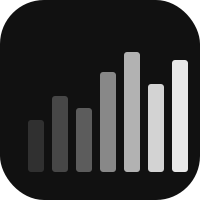

# Cadence

Code progress tracker. Visualizes GitHub commit history via the GraphQL API.

## Platforms
- **web** — Dashboard at [cadence.heyitsmejosh.com](https://cadence.heyitsmejosh.com) (Chart.js)
- **iOS** — SwiftUI, wired to live API
- **macOS** — SwiftUI, wired to live API

## Stack
Vercel serverless functions (`api/`) + vanilla JS web. MIT 2026 Joshua Trommel.

## API
- `GET /api/stats` — total30, streak, bestDay, daily map, perRepo
- `GET /api/heatmap` — 365-day {date: count} map
- `GET /api/projects` — repos sorted by commits in last 30 days
