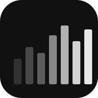
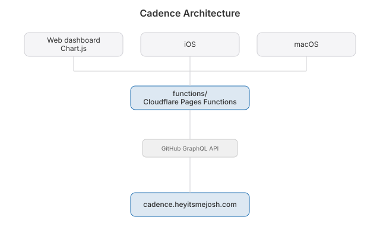

# Cadence

How much did you ship? Cadence pulls your GitHub commit history through the GraphQL API and draws it: streaks, best days, what's hot this month.

## Platforms
- **web**: the dashboard at [cadence.heyitsmejosh.com](https://cadence.heyitsmejosh.com), Chart.js
- **iOS**: SwiftUI, on the live API
- **macOS**: SwiftUI, on the live API

## Stack
Serverless functions in `api/` and plain JS on the front. MIT 2026 Joshua Trommel.

## API
- `GET /api/stats`: total30, streak, bestDay, daily map, perRepo
- `GET /api/heatmap`: 365 days of {date: count}
- `GET /api/projects`: repos by commits in the last 30 days

## Whitepaper

[Technical whitepaper](WHITEPAPER.md)

## API and agent tools

An agent can drive this app. [`docs/API.md`](docs/API.md) lists the HTTP surface, where there
is one, and the WebMCP tools registered on `document.modelContext`. Tools come in three kinds:
read-only, writes you can undo, and the few that ask a human first.

## Architecture

## License

MIT 2026, Joshua Trommel
